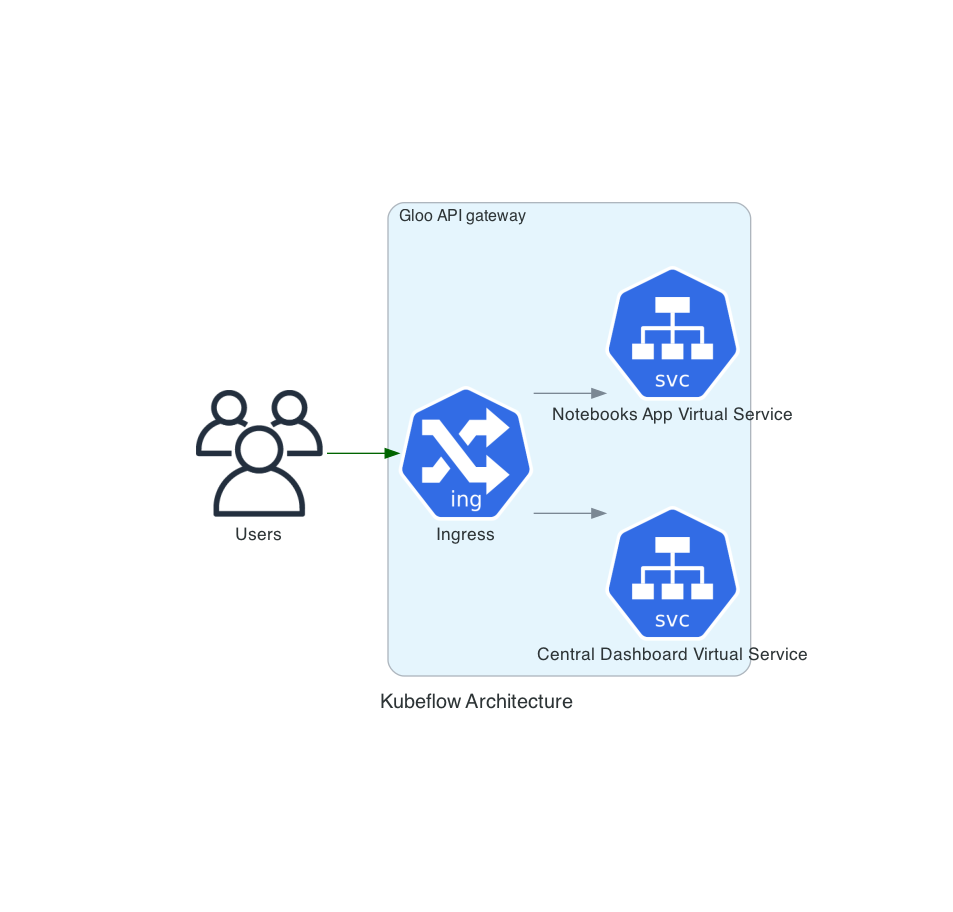

# Ingress

Now, there are multiple ways to go about connecting different services in a cluster. I'm going to go for [Gloo](https://docs.solo.io/gloo/latest/getting_started/).

Here's why:
- Simple installation
- External Auth Support
- API Gateway for Ingress
- Easy to add services into the gateway (Virtual Services)
- Knative Support

Very good alterantives to consider:
- [Ambassador](https://www.getambassador.io/docs/latest/)
- [Contour]()
- [Kong]()
- [Istio]()

## Networking Architecture

